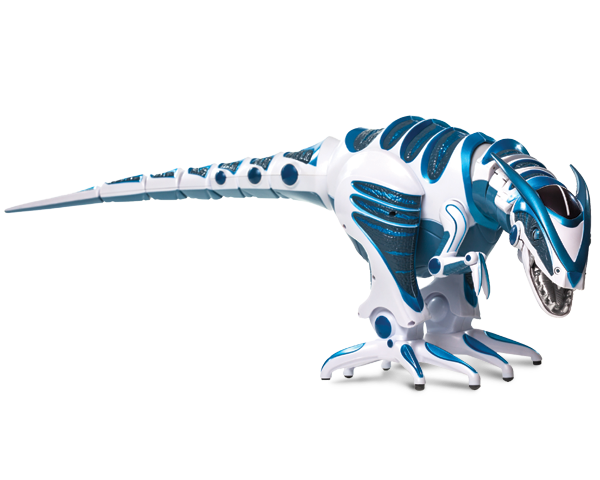
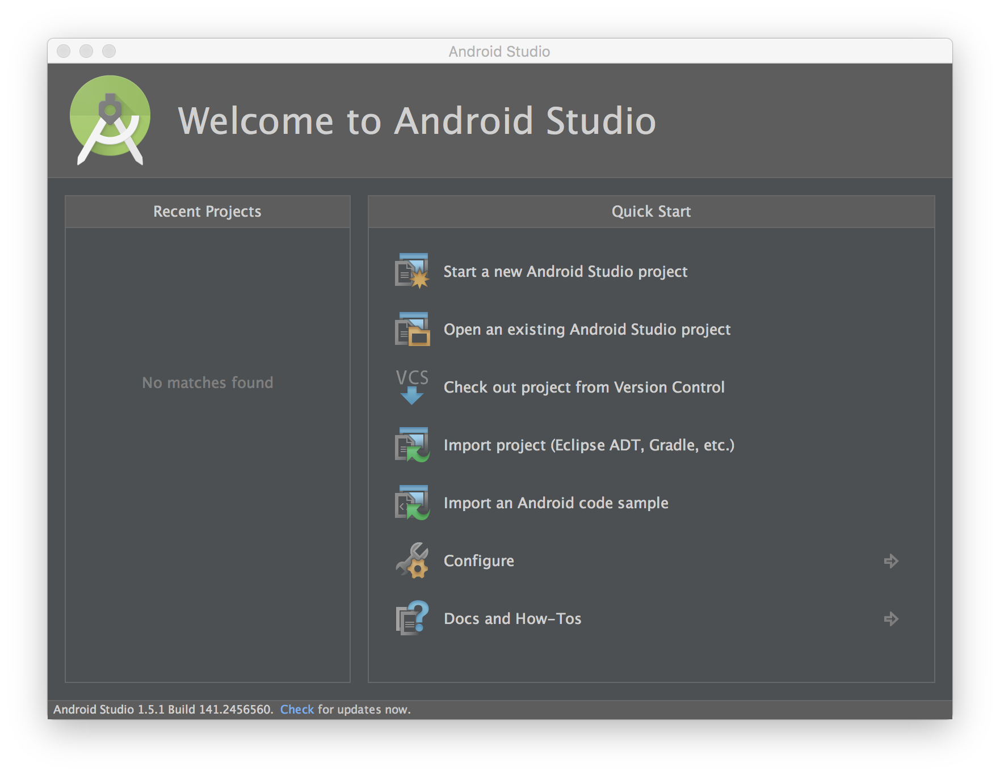
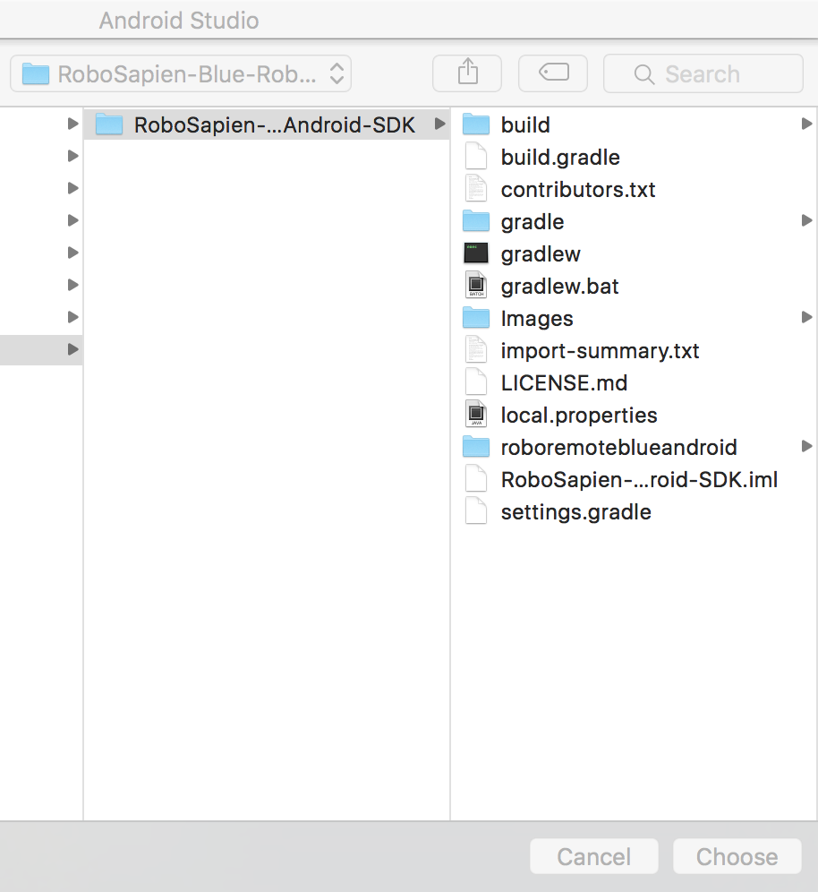
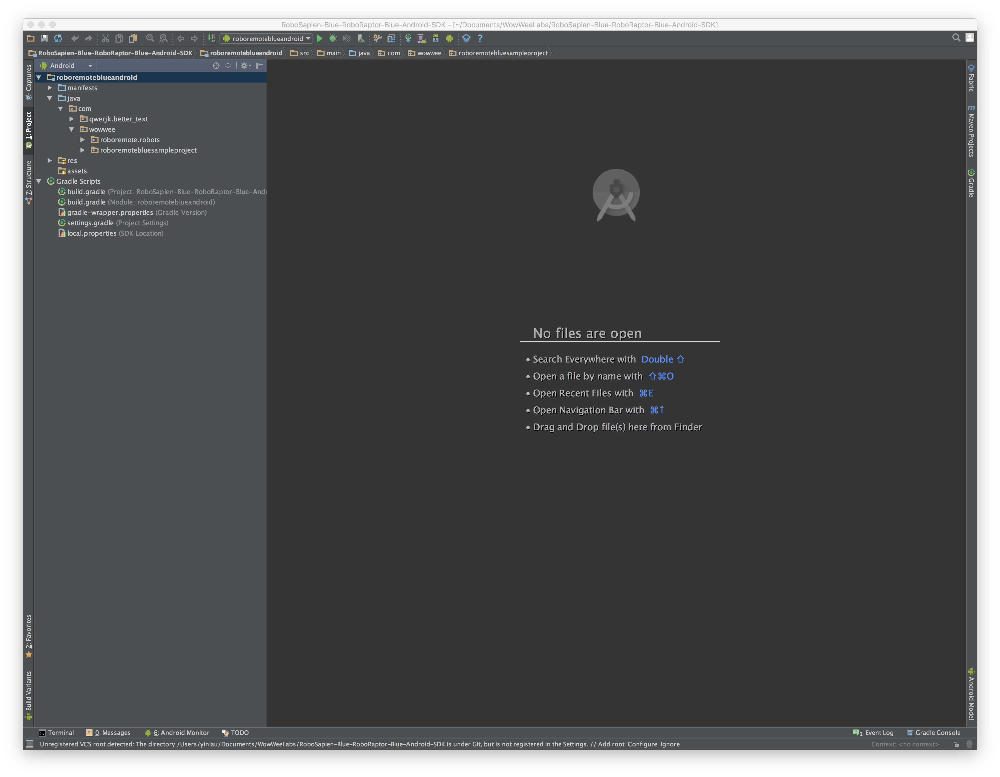

WowWee RoboSapien Blue RoboRaptor Blue Android SDK
================================

The free RoboSapien Blue RoboRaptor Blue Android SDK lets you control your [WowWee RoboSapien](http://wowwee.com/robosapien-blue) and [WowWee RoboRaptor](http://wowwee.com/roboraptor-blue) on devices running Android 2.2 and above with Bluetooth Low Energy chipsets. To use this SDK you will also need a physical RoboSapien robot or RoboRaptor robot.

For information on WowWee products visit: <http://www.wowwee.com>

Table of Contents
---------------------------------------

- [Quick Installation](#quick-installation)
- [Notes about the SDK](#notes-about-the-sdk)
- [License](#license)
- [Contributing](#contributing)
- [Projects using this SDK](#projects-using-this-sdk)

Quick Installation
---------------------------------

1. Clone the repository or [download the zip](https://github.com/WowWeeLabs/RoboSapien-Blue-RoboRaptor-Blue-Android-SDK/archive/master.zip).

		git clone https://github.com/WowWeeLabs/RoboSapien-Blue-RoboRaptor-Blue-Android-SDK.git

2. Open Android Studio and click "Open an existing Android Studio project".

	

3. Select the git project folder "RoboSapien-Blue-RoboRaptor-Blue-Android-SDK" and click "Choose".

	

4. You should be now ready to go! Plug in an Android device then compile and run the project using CTRL + R on Mac, or SHIFT + F10 on Windows. When you turn on a RoboSapien or RoboRaptor, you should see some debug messages in the logs.

	

Notes about the SDK
---------------------------------

### Simulator Support

Our SDK cannot be used in the built in Android simulator due to lack of Bluetooth Low Energy support. Third party alternatives may work if they support the official BLE APIs.

### Android Gear Support

At present we havn't added support for Android gear. Third party support is welcome, please add an issue in the bug tracker.

### Full Source Code

At this stage we do not plan on releasing our full library source code.

### Are there any restrictions on releasing my own application?

The SDK is currently and will always be free for you to build and release your own applications. Your welcome to charge money or release free applications using our SDK without restrictions.

If you create a great application, all we ask is that you provide a link for people to purchase their own RoboSapien and RoboRaptor so they can enjoy your product.

License
---------------------------------
RoboSapien Blue RoboRaptor Blue Android SDK is available under the Apache License, Version 2.0 license. See the [LICENSE.txt](https://raw.githubusercontent.com/WowWeeLabs/RoboSapien-Blue-RoboRaptor-Blue-Android-SDK/master/LICENSE.md) file for more info.

You are free to use our SDK in your own projects whether free or paid. There are no restrictions on releasing into Google Play or other stores. We do ask that you clearly differentiate your app from the official app so that users do not get confused.

Contributing
---------------------------------
We happily accept any pull requests and monitor issues on GitHub regularly. Please feel free to give us your suggestions or enhancements. Please note that due to resource constraints we most likely cannot add new features to the RoboSapien robot or RoboRaptor robot itself, but we will certainly consider them for inclusion to future robot/versions.

Tell your friends, fork our project, buy our robot and share with us your own projects! These are the best kinds of positive feedback to us.

Projects using this SDK
---------------------------------
* [WowWee RoboRemote Bluetooth Official App](https://play.google.com/store/apps/details?id=com.wowwee.roboremoteblue)
* Send us a pull request to add your app here
